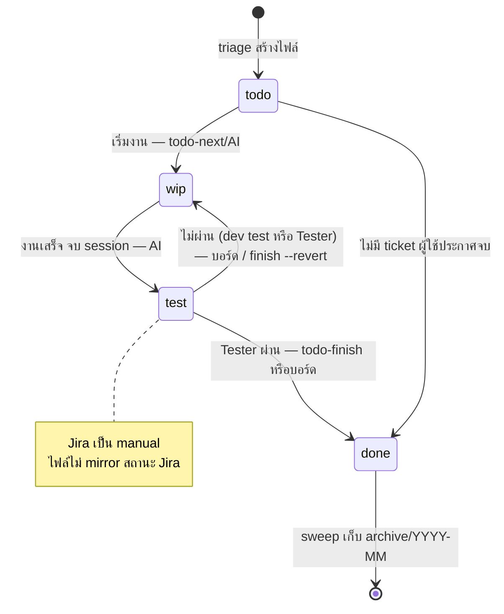
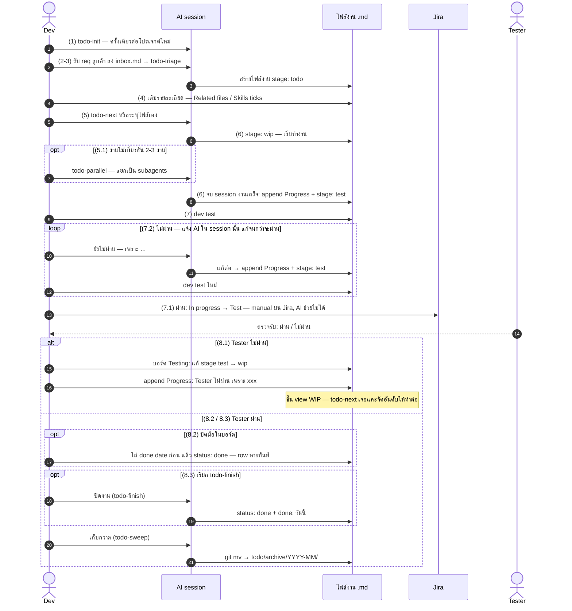

# Todo Diagrams — ภาพรวมและ scenario ของระบบ todo

เอกสารประกอบไดอะแกรมของระบบ `todo/` — ฉบับละเอียดกว่าที่ฝังไว้ใน README
ต้นฉบับ `.mmd` อยู่ที่ `assets/todo-lifecycle-th.mmd` และ `assets/todo-scenario-th.mmd`
(แก้ไดอะแกรมแล้ว sync ทั้งไฟล์นี้และ `.mmd` ทั้งสองด้วยมือ — ไม่มี build step)

## 1. Lifecycle ของ task (stateDiagram-v2)



### แต่ละ state คืออะไร

| State | ความหมาย | ดูที่ไหน |
|---|---|---|
| `stage: todo` | ยังไม่เริ่ม — ไฟล์ถูกสร้างโดย todo-triage แล้วรอถูกเลือก | view **All** |
| `stage: wip` | เริ่มแล้วยังไม่จบ — รวมงานที่ถูกคืนกลับมาแก้ (Tester/dev-test ไม่ผ่าน) | view **WIP** |
| `stage: test` | งานเสร็จ รอผล dev test → Jira → Tester | view **Testing** |
| `status: done` | ปิดแล้ว — หายจากบอร์ดทันที (filter `status != "done"`) รอ sweep เก็บ | ไม่แสดงบนบอร์ด |

### แต่ละเส้น transition ใครทำ ด้วยอะไร

| เปลี่ยน | ทริกเกอร์ | ผู้ทำ | เครื่องมือ |
|---|---|---|---|
| todo → wip | เริ่มทำงาน | AI | todo-next step 6 / dev ระบุไฟล์เอง |
| wip → test | จบ session ที่งานเสร็จ | AI | ใน session / todo-parallel step 5 |
| test → wip | dev test หรือ Tester ไม่ผ่าน | dev หรือ script | แก้ cell ใน view Testing หรือ `finish.py --revert` |
| test → done | Tester ผ่าน (หรืองานไม่มี ticket และผู้ใช้ประกาศจบ) | dev หรือ script | `todo-finish` หรือแก้ cell ใน view Testing |
| done → archive | เก็บกวาด | AI ตามคำสั่ง | todo-sweep — `git mv` ไป `todo/archive/YYYY-MM/` |

**ข้อควรระวังตอนปิดงานมือในบอร์ด:** ใส่คอลัมน์ `done` (วันที่) **ก่อน** เปลี่ยน `status: done` —
row จะหายจากบอร์ดทันทีที่ status เป็น done จาก filter ระดับบน ถ้าพลิกสลับลำดับจะตั้งวันที่ไม่ทัน
(ใช้ `todo-finish` แล้วจบในคำสั่งเดียว ไม่มีปัญหานี้)

**Jira:** transition ฝั่ง Jira (In progress → Test, Test → Done) เป็น manual ของ dev/Tester เสมอ —
`jira.md` เป็นแค่รายการอ่าน (JQL) และไฟล์งานไม่ mirror สถานะ Jira กลับเข้ามา (RULES ข้อ 1)

## 2. Scenario ของ 1 งาน (sequenceDiagram)

เส้นทางของ 1 งาน ครบทุกกิ่ง — loop dev test ไม่ผ่าน (7.2), Tester ไม่ผ่าน (8.1) และการปิดงาน 2 แบบ (8.2 / 8.3) ตัวเลขในวงเล็บ (n) กำกับขั้นตอนตาม flow ที่กำหนดไว้



### อ่าน scenario ทีละช่วง

- **(1) ติดตั้ง:** todo-init ครั้งเดียวต่อโปรเจกต์ — สร้าง `todo/`, บอร์ด 3 views และกฎใน AGENTS.md
- **(2–4) รับและเตรียมงาน:** req ลง `inbox.md` → todo-triage สร้างไฟล์ `stage: todo` → dev เติม Related files / Skills ticks เอง
- **(5–6) เลือกและลงมือ:** todo-next หรือระบุไฟล์เอง → `stage: wip` — งานไม่เกี่ยวกัน 2–3 งานใช้ todo-parallel (5.1) ได้ → จบ session ที่งานเสร็จ AI append `## Progress` + `stage: test`
- **(7) dev test:** ไม่ผ่าน (7.2) วน loop เดิม — แจ้ง AI ใน session นั้นแล้วแก้จนผ่าน; ผ่านแล้ว (7.1) dev ย้าย Jira เป็น Test **manual บน Jira — AI ช่วยไม่ได้**
- **(8.1) Tester ไม่ผ่าน:** dev แก้ stage เป็น wip ในบอร์ด (หรือ `finish.py --revert`) + **แนบเหตุผลลง `## Progress` เสมอ** — งานขึ้น view WIP แล้ว todo-next จัดอันดับให้ทำต่อ (วนกลับไปขั้นแก้งาน)
- **(8.2 / 8.3) Tester ผ่าน — เลือกทางหนึ่ง:** ปิดมือในบอร์ด (8.2: ใส่ done date **ก่อน** status: done เพราะ row หายทันที) หรือเรียก todo-finish (8.3: `status: done` + done วันนี้ในคำสั่งเดียว)
- **(ปิดท้าย) เก็บกวาด:** todo-sweep ย้ายไฟล์ไป `todo/archive/YYYY-MM/` ตามเดือนของวันที่ done

## 3. Render ดูละเอียด (pretty-mermaid)

`.mmd` ใน `assets/` render เป็นไฟล์ใหญ่ดูได้ทุกขนาด:

```bash
node <skill-root ของ pretty-mermaid>/scripts/render.mjs \
  --input assets/todo-scenario-th.mmd \
  --output scenario.png --format png --width 2400 --theme github-light
```

GitHub และ Obsidian ก็ render บล็อก mermaid ในเอกสารนี้ให้เอง — เปิดไฟล์นี้ใน Obsidian ก็ดูได้เลย
